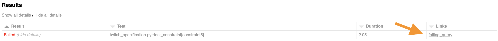
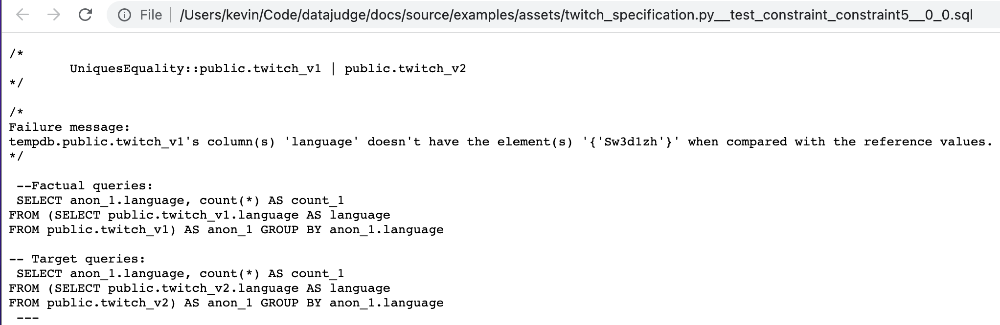

Testing
=======

While ``datajudge`` allows to express expectations via specifications, ``Requirement`` s
and ``Constraint`` s, the execution of tests is delegated to pytest. As a
consequence, one may use any functionalities that pytest has to offer. Here,
we want to illustrate some of these advanced functionalities that might turn out useful.

Yet, it should be noted that for most intents and purposes, using ``datajudge`` 's helper
function :func:`~datajudge.pytest_integration.collect_data_tests` is a good starting
point. It should work out of the box and hides some complexity. For exemplary applications
see, the
:doc:`companies example <examples/example>` or the
:doc:`twitch example <examples/example_twitch>`.

Throughout this article we will not rely on ``collect_data_tests``. Instead we will more
explicitly create a mechanism turning a List of ``Requirement`` objects into something
that can be tested by pytest manually. Importantly, we want every ``Constraint`` of every
``Requirement`` to be tested independently of each other. For instance, we would not like
one failing test to halt all others.

Many of these approaches rely on adapting pytest's ``conftest.py``. If you are not familiar
with this concept, you might want to read up on it
`in the pytest docs <https://docs.pytest.org/en/6.2.x/writing_plugins.html#conftest-py-plugins>`_.

Subselection
------------

Most often one might want to run all tests defined by a specification.

Yet, for example after believing to have fixed a data problem, one might simply
want to test whether a single test, which had previously been failing, succeeds
at last.

Another example for when one would like to test a subset of tests is if the data at
hand is not available in its entirety. Rather, it could be that one would like
to run a subset of the test suite against a subsample of the typical dataset.

In this section, we present two approaches to do a subselection of tests.

Ex-post: subselecting generated tests
*************************************

Instead of merely running  ``$ pytest specification.py`` one may add pytests's
``-k`` flag and specify the ``Constraint`` (s) one cares about.

Importantly, every ``Constraint`` object can be identified via a name. If one wants
to figure out how this string is built, please refer to the implementation of
:meth:`~datajudge.constraints.base.Constraint.get_description`.
Otherwise, one could also just run all of the tests once and investigate
the resulting test report to find the relevant names.

When only caring about the ``UniquesEquality`` constraint in our
:doc:`twitch example <examples/example_twitch>`.
one might for instance use the following prefix the filter for it:

.. code-block:: console

  $ pytest twitch_specification.py -k "UniquesEquality::public.twitch_v1"

Ex-ante: Defining categories of tests
*************************************

Another option to subselect a certain set of tests is by use of
`pytest markers <https://docs.pytest.org/en/7.1.x/example/markers.html>`_.
The following is one way of using markers in conjunction with ``datajudge``.

In this particular illustration we'll allow for two markers:

* ``basic``: indicating that only truly fundamental tests should be run
* ``all``: indicating that any available test should be run

For that matter we'll add a bit of pytest magic to the respective ``conftest.py``.

.. code-block:: python
  :caption: ``conftest.py``

  def pytest_generate_tests(metafunc):
      if "basic_constraint" in metafunc.fixturenames:
          metafunc.parametrize(
              "basic_constraint",
              # Find these functions in specification.py.
              metafunc.module.get_basic_constraints(),
              ids=metafunc.module.idfn,
	  )
      if "constraint" in metafunc.fixturenames:
          metafunc.parametrize(
              "constraint",
              # Find these functions in specification.py.
              metafunc.module.get_all_constraints(),
              ids=metafunc.module.idfn,
          )

Moreover, we'll have to register these markers in pytest's ``pytest.ini`` file.
You can read more about these files
`here <https://docs.pytest.org/en/6.2.x/customize.html>`_.

.. code-block::
   :caption: ``pytest.ini``

   [pytest]
   addopts = --strict-markers
   markers = basic: basic specification
	     all: entire specification

Once that is taken care of, one can adapt one's specification as follows:

.. code-block:: python
  :caption: ``specification.py``

  def get_basic_requirements() -> List[Requirement]:
      # Create relevant Requirement objects and respective Constraints.
      # ...

      return requirements

  def get_advanced_requirements() -> List[Requirement]:
      # Create relevant Requirement objects and respective Constraints.
      # ...

      return requirements

  def get_basic_constraints() -> List[Constraint]:
      return [constraint for requirement in get_basic_requirements() for constraint in requirement]

  def get_all_constraints() -> List[Constraint]:
      all_requirements = get_basic_requirements() + get_advanced_requirements()
      return [constraint for requirement in all_requirements for constraint in requirement]

  # Function used in conftest.py.
  # Given a constraint, returns an identifier used to refer to it as a test.
  def idfn(constraint):
      return constraint.get_description()

  @pytest.mark.basic
  def test_basic_constraint(basic_constraint: Constraint, datajudge_engine):
      test_result = basic_constraint.test(datajudge_engine)
      assert test_result.outcome, test_result.failure_message

  @pytest.mark.all
  def test_all_constraint(constraint: Constraint, datajudge_engine):
      test_result = constraint.test(datajudge_engine)
      assert test_result.outcome, test_result.failure_message

Once these changes are taken care of, one may run

.. code-block:: console

  $ pytest specification.py -m basic

to only test the basic ``Requirement`` s or

.. code-block:: console

  $ pytest specification.py -m all

to test all ``Requirement`` s.

Using parameters in a specification
-----------------------------------

A given specification might rely on identifiers such as database names or
table names. Moreover it might be that, e.g. when iterating from one version
of the data to another, these names change.

In other words, it could be that the logic should remain unchanged while pointers
to data might change. Therefore, one might just as well consider
those pointers or identifiers as parameters of the specification.

For the sake of concreteness, we will assume here that we wish frame two
identifiers as parameters:

* ``new_db``: the name of the 'new database'
* ``old_db``: the name of the 'old database'

In light of that we will again adapt pytest's ``conftest.py``:

.. code-block:: python
  :caption: ``conftest.py``

  def pytest_addoption(parser):
      parser.addoption("--new_db", action="store", help="name of the new database")
      parser.addoption("--old_db", action="store", help="name of the old database")

  def pytest_generate_tests(metafunc):
      params = {
          "db_name_new": metafunc.config.option.new_db,
          "db_name_old": metafunc.config.option.old_db,
      }
      metafunc.parametrize(
          "constraint",
          metafunc.module.get_constraints(params),
          ids=metafunc.module.idfn,
      )

Now, we can make the creation of our ``Requirement`` s and ``Constraint`` s
dependent on these parameters:

.. code-block:: python
  :caption: ``specification.py``

  def get_requirements(params):
      between_requirement = BetweenRequirement.from_tables(
          db_name1=params["old_db"],
	  db_name2=params["new_db"],
	  # ...
      )
      # ...
      return requirements

  def get_constraints(params):
      return [
	  constraint for requirement in get_requirements(params) for constraint in requirement
      ]

  def idfn(constraint):
      return constraint.get_description()

  def test_constraint(constraint, datajudge_engine):
      test_result = constraint.test(datajudge_engine)
      assert test_result.outcome, test_result.failure_message

Once the specification is defined to be dependent on such parameters, they can
simply be passed via CLI:

.. code-block:: console

  $ pytest specification.py --new_db=db_v1 --old_db=db_v2

Html reports
------------

By default, running ``pytest`` tests will output test results to one's respective shell.
Alternatively, one might want to generate an html report summarizing and expanding on
all test results. This can be advantageous for

* Sharing test results with colleagues
* Archiving and tracking test results over time
* Make underlying sql queries conveniently accessible

Concretely, such an html report can be generated by
`pytest-html <https://github.com/pytest-dev/pytest-html>`_. Once installed, using it is as simple
as appending ``--html=myreport.html`` to the pytest call.

In our twitch example, this generates `this html report <https://github.com/Quantco/datajudge/tree/main/docs/source/examples/twitch_report.html>`_.

Retrieving queries
------------------

Usually we not only care about knowing whether there is a problem with the data
at hand and what it is. Rather, we would also like to fix it as fast and
conveniently as possible.

For that matter, ``datajudge`` makes the queries it uses to assert testing predicates
available via the :class:`datajudge.constraints.base.TestResult`
class. Hence, if a test is failing, the user can jumpstart the investigation of the
problem by reusing and potentially adapting the underlying queries.

Instead of simply running ``assert constraint.test(engine).outcome``, one may add
the ``TestResult`` 's ``logging_message`` to e.g. a ``logger`` or add it to pytest
``extra``:

.. code-block:: python

  from pytest_html import extras

  def test_constraint(constraint: Constraint, engine, extra):
    test_result = constraint.test(engine)
    message = test_result.logging_message

    if not test_result.outcome:
      # Send to logger.
      logger.info(message)
      # Add to html report.
      extra.append(
        extras.extra(
          content=message,
          format_type="text",
          name="failing_query",
          mime_type="text/plain",
          extension="sql",
        )
      )

   assert test_result.outcome

Such a ``logging_message`` - with ready to execute sql queries - can look as follows:

.. code-block:: sql

  /*
  Failure message:
  tempdb.public.twitch_v1's column(s) 'language' doesn't have the
  element(s) '{'Sw3d1zh'}' when compared with the reference values.
  */

   --Factual queries:
   SELECT anon_1.language, count(*) AS count_1
  FROM (SELECT public.twitch_v1.language AS language
  FROM public.twitch_v1) AS anon_1 GROUP BY anon_1.language

  -- Target queries:
   SELECT anon_1.language, count(*) AS count_1
  FROM (SELECT public.twitch_v2.language AS language
  FROM public.twitch_v2) AS anon_1 GROUP BY anon_1.language

If using a mechanism - as previously outlined - to forward these messages to
an html report, this can look as follows:

